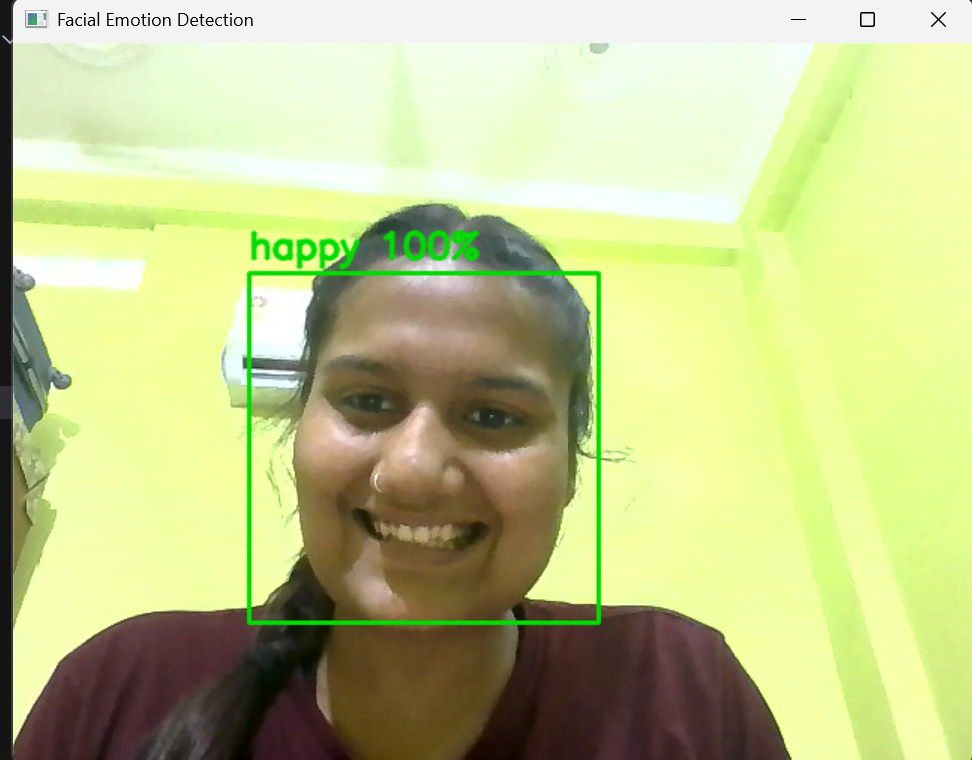
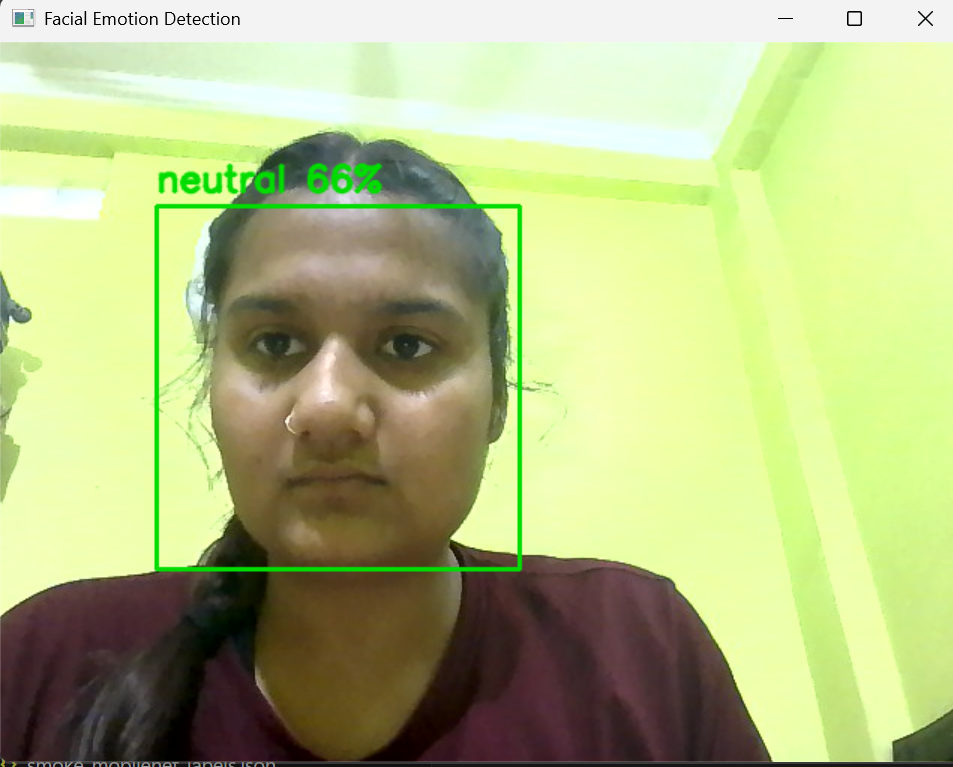
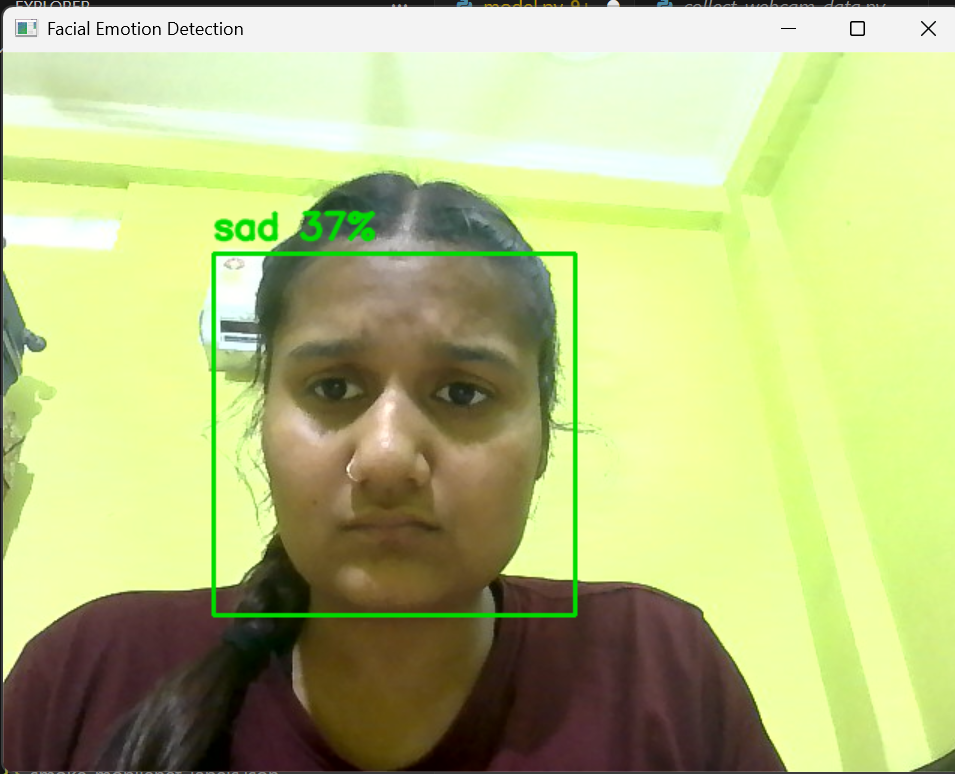
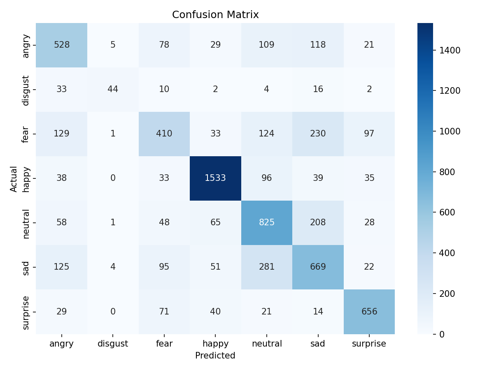

<div align="center">

# Facial Emotion Recognition

### Real-time facial expression classification with TensorFlow and OpenCV

[](https://www.python.org/)
[](https://www.tensorflow.org/)
[](https://opencv.org/)
[](LICENSE)

An end-to-end deep learning project that trains, evaluates, and deploys a
seven-class facial emotion recognition model for images and live webcam video.

**Developed by [Manshi Verma](https://github.com/Manshi08044M)**

</div>

---

## Live Demo

| Happy | Neutral | Sad |
|:---:|:---:|:---:|
|  |  |  |

## Overview

The system detects faces with OpenCV's Haar Cascade classifier and predicts
the visible expression using a trained Keras model. It supports a custom CNN
for compact grayscale inputs and MobileNetV2 for transfer-learning experiments.
Live predictions are averaged across recent frames to provide a more stable
webcam experience.

### Recognized Emotions

`angry` · `disgust` · `fear` · `happy` · `neutral` · `sad` · `surprise`

## Highlights

- Real-time webcam emotion detection with confidence scores
- Seven-class facial expression classification
- Custom CNN and MobileNetV2 training options
- Data augmentation and automatic class weighting
- Checkpointing, early stopping, learning-rate scheduling, and resume support
- Evaluation through classification reports and confusion matrices
- Single-image prediction from the command line
- Saved trained model included for a quick webcam demo

## Performance

The project was trained and evaluated on a FER-2013-style dataset containing
**35,817 facial images**.

| Metric | Result |
|---|---:|
| Training images | 28,709 |
| Validation images | 7,108 |
| Best recorded training accuracy | 70.11% |
| Best recorded validation accuracy | **65.63%** |

<div align="center">
  
</div>

> Emotion recognition from facial expressions is probabilistic. Predictions
> should not be treated as definitive conclusions about a person's emotional
> or mental state.

## How It Works

```text
Webcam or image
      |
      v
Face detection (OpenCV Haar Cascade)
      |
      v
Resize and preprocess for the selected model
      |
      v
CNN / MobileNetV2 emotion classification
      |
      v
Confidence threshold + temporal smoothing
      |
      v
Emotion label displayed on screen
```

## Project Structure

```text
facial-emotion-recognition/
|-- assets/screenshots/           # Real-time demo screenshots
|-- code/
|   |-- camera_emotion.py         # Live webcam inference
|   |-- check_dataset_counts.py   # Dataset distribution utility
|   `-- model.py                  # Train, evaluate, and predict
|-- reports/                      # Experiment results and confusion matrices
|-- emotion_labels.json           # Ordered emotion classes
|-- emotion_model.keras           # Best saved CNN model
|-- requirements.txt
`-- README.md
```

The raw dataset and temporary experiment models are intentionally excluded
from GitHub to keep the repository lightweight.

## Getting Started

### Prerequisites

- Python 3.10 or newer
- A webcam for real-time detection
- Git

### Installation

```bash
git clone https://github.com/Manshi08044M/facial-emotion-recognition.git
cd facial-emotion-recognition

python -m venv .venv
```

Activate the environment:

```powershell
# Windows PowerShell
.\.venv\Scripts\Activate.ps1
```

```bash
# macOS / Linux
source .venv/bin/activate
```

Install dependencies:

```bash
pip install -r requirements.txt
```

## Run the Webcam Demo

The trained `emotion_model.keras` file is included, so the live demo can be
started immediately:

```bash
python code/camera_emotion.py
```

Press `q` to close the webcam window.

Optional webcam settings:

```bash
python code/camera_emotion.py --camera 0 --min-confidence 0.35 --smooth-frames 7
```

## Dataset Setup

To train or evaluate the model, place a FER-2013-style dataset in the following
directory structure:

```text
dataset/
|-- train/
|   |-- angry/
|   |-- disgust/
|   |-- fear/
|   |-- happy/
|   |-- neutral/
|   |-- sad/
|   `-- surprise/
`-- validation/
    |-- angry/
    |-- disgust/
    |-- fear/
    |-- happy/
    |-- neutral/
    |-- sad/
    `-- surprise/
```

Check the distribution before training:

```bash
python code/check_dataset_counts.py --dataset-dir dataset
```

## Training and Evaluation

Train the default custom CNN:

```bash
python code/model.py --mode train
```

Train with MobileNetV2 transfer learning:

```bash
python code/model.py --mode train --architecture mobilenetv2
```

Resume training from an existing model:

```bash
python code/model.py --mode train --resume --learning-rate 0.0001
```

Evaluate the saved model:

```bash
python code/model.py --mode evaluate
```

Predict an emotion from one image:

```bash
python code/model.py --mode predict --image path/to/image.jpg
```

## Model Architectures

### Custom CNN

The primary model accepts `48 x 48` grayscale images and uses stacked
convolutional blocks, batch normalization, max pooling, dropout, global average
pooling, and a softmax classifier.

### MobileNetV2

The transfer-learning option accepts `224 x 224` RGB images and fine-tunes the
final MobileNetV2 layers before a custom dense classification head.

## Tech Stack

- **Deep Learning:** TensorFlow, Keras
- **Computer Vision:** OpenCV
- **Data Processing:** NumPy, Pillow
- **Evaluation:** Scikit-learn
- **Visualization:** Matplotlib, Seaborn

## Limitations and Future Work

- Improve face detection for rotated and partially visible faces
- Add more balanced and diverse training data
- Tune hyperparameters and compare additional pretrained architectures
- Build a browser-based interface and deploy the model
- Evaluate model fairness across demographic groups

## Author

**Manshi Verma**

- GitHub: [@Manshi08044M](https://github.com/Manshi08044M)
- Focus: Data Science, Python, Java, and problem solving

## License

This project is licensed under the [MIT License](LICENSE).

